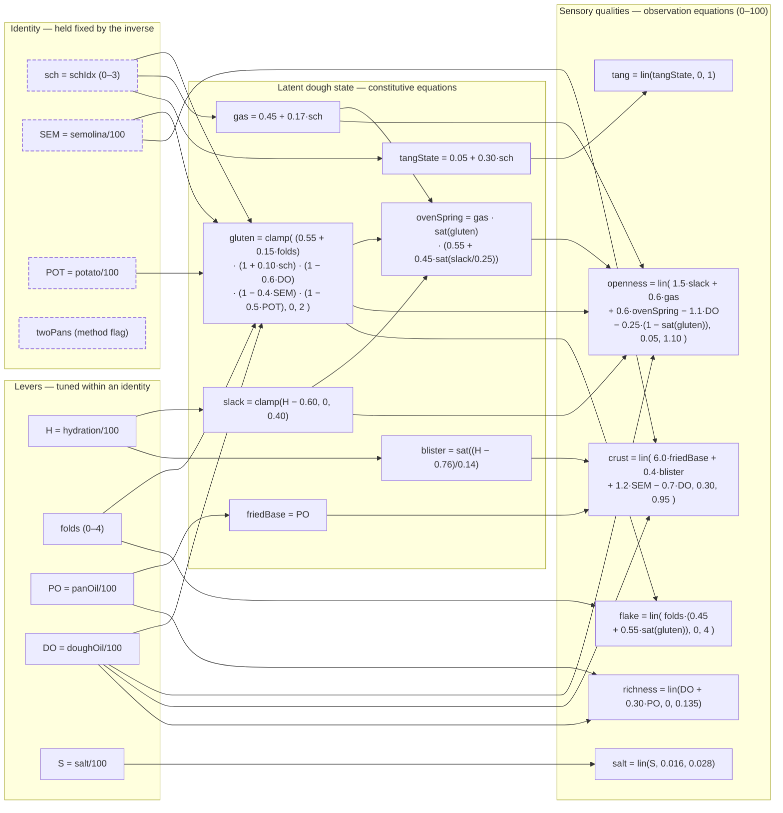
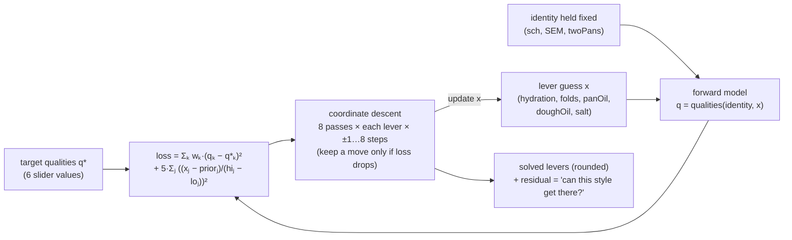

> [!abstract]
> The focaccia calculator is a small **multivariate system of coupled algebraic
> equations**, solved in two directions. Forward: a recipe flows through a layer of
> *constitutive* equations into a latent dough state, then through a layer of
> *observation* equations into six sensory qualities. Inverse: hold the **identity**
> fixed and coordinate-descend the **levers** until the qualities match a target.
>
> ```
> recipe ──(constitutive)──▶ latent dough state ──(observation)──▶ qualities
> ```

## Reading the graph

- **Identity** (dashed) is what makes a focaccia *what it is* — the ferment schedule,
  durum-semola share, boiled-potato share, the two-pan deep bake. The inverse never
  solves it away.
- **Levers** are the continuous dials tuned *within* an identity: hydration, folds,
  pan oil, dough oil, salt.
- Every arrow is a term in the equation written inside the node it points to. A node
  with many incoming arrows is where variables couple.

**Helpers.** `clamp(x, lo, hi)` clips `x` to `[lo, hi]`; `sat(x) = clamp(x, 0, 1)`;
`lin(x, lo, hi)` maps `x` from `[lo, hi]` onto the **0–100** quality scale (clipped).
Units are baker's % ÷ 100, so flour = 1.

## Forward model



`twoPans` is an identity dimension that selects the bake *method/format* but does not
enter these algebraic equations — it carries no outgoing arrow.

## Inverse — solve levers, identity held

The UI drives the **qualities** (six sliders) and asks for a recipe. With the identity
fixed, the solver coordinate-descends the five levers to minimise a regularised
squared-error loss, so freestyle targets still land on a real style.



The second term in the loss is a **prior pull** toward each lever's default — it keeps
solutions plausible when the qualities under-determine the recipe. A high residual means
the held identity simply *can't* reach the requested qualities.

## Provenance

Coefficients are hand-set and cited to the corpus — gluten development and oven spring
from Cauvain's *Technology of Breadmaking*, fat-shortening and flour-gluten effects from
Bressanini's *Scienza della Pasticceria*. See `CITES` in
[`focaccia-model.js`](https://github.com/4AM365/foccaciabot/blob/master/src/focaccia-model.js).

Try it on the [Focaccia Calculator](/kitchen/focaccia-calculator).
